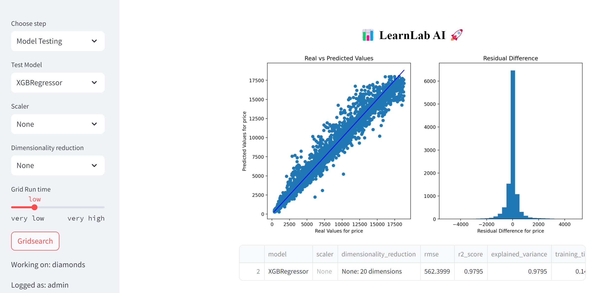

# LearnLab IA

## :rocket: Status
This application is in beta state. Any beta testing and feedback is welcomed!


[Give it a try!](https://mlassistant.streamlit.app/)


## :running: One-liner
LearnLab AI is a web application that allows users to construct Machine Learning models without the need for coding, with integration and assistance from OpenAI.

## :computer: Technology Stack
Hosted on [streamlit](https://streamlit.io/) as a web application and integrated with OpenAI's API. Key libraries include Pandas, Numpy, sklearn, Seaborn and Sqlite.

## :boom: Core Technical Concepts and Inspiration
Utilizes a fully customizable pipeline to create machine learning model.

## :wrench: Configuration
For testing and personal usage, visit the provided [link](https://mlassistant.streamlit.app/). To run the script locally, clone the repository, create a virtual environment, install Python, and run `pip install -r requirements.txt` in the project folder.

## :file_folder: Folder Structure

```
└── project
    └── data
    │    ├── clean  
    │    ├── example_datasets
    │    └── src
    ├── notebooks
    │   ├── assistant.ipynb
    │   ├── sql.ipynb
    │   └── test.ipynb
    ├── users
    ├── .env
    ├── .gitignore
    ├── Presentacion.pptx
    ├── LICENSE
    ├── main.py
    ├── README.md
    ├── requirements.txt
    └── SQL.log
```
## License
[License](LICENSE.txt)